<a id="readme-top"></a>


<!-- PROJECT LOGO -->
<br />
<div align="center">
  <!-- <a href="https://github.com/othneildrew/Best-README-Template">
    
  </a> -->

  <h3 align="center">Camping Elicrisi</h3>

    
  </p>
</div>


<!-- ABOUT THE PROJECT -->
## About The Project

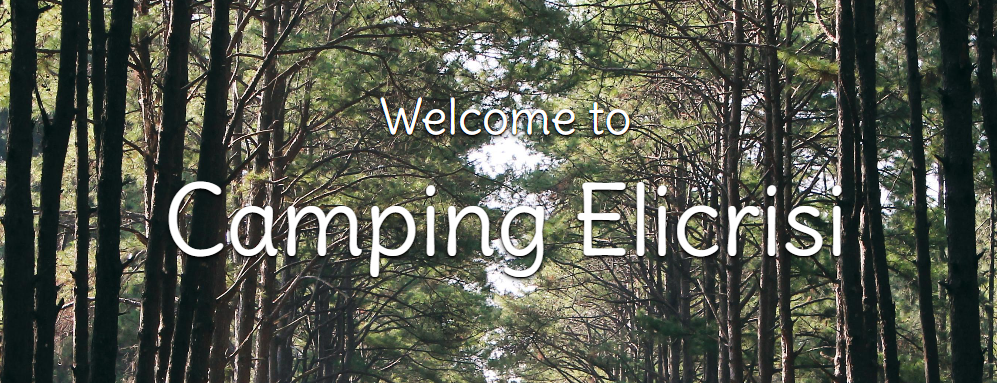

# Camping Elicrisi –  Campeggio sul Mare 🏕️🌊

Camping Elicrisi è una piattaforma web pensata per la gestione completa di un campeggio situato a pochi passi dal mare. Il progetto integra competenze sia di **Front-End** che di **Back-End**, ed è stato sviluppato come esercizio completo di progettazione, sviluppo e organizzazione di un'applicazione reale.

Il sito è suddiviso in due principali sezioni:
- **Area pubblica:** dedicata ai clienti
- **Area privata:** (backoffice) dedicata agli amministratori

---

## 🌐 Pagine del Sito (Client-Side)

- **Home**  
  Presentazione del campeggio, filosofia dei fondatori e atmosfera del luogo

- **Alloggi**  
  Panoramica delle sistemazioni disponibili: piazzole, bungalow e glamping

- **Prenota**  
  Sistema di prenotazione online per selezionare alloggio e periodo

- **Ristorante**  
  Menù disponibili, orari di apertura e possibilità di prenotare un tavolo

- **Nei Dintorni** *(in sviluppo)*  
  Informazioni su spiagge, attività ed esperienze nei dintorni del campeggio

- **Contatti**  
  Numeri, email e altri riferimenti per comunicare direttamente con lo staff

- **Le Mie Prenotazioni**  
  Sezione dove l’utente inserisce il proprio codice di prenotazione per visualizzare i dettagli, **senza autenticazione o login**

---

## 🔒 Backoffice (Admin-Side)

Area riservata alla gestione delle funzionalità principali:
- Visualizzazione e modifica delle prenotazioni
- Gestione degli alloggi disponibili (in sviluppo)
- Anagrafica dei clienti
- Visualizzazione e modifica delle prenotazioni del ristorante
- Aggiornamento dei contenuti del sito (in sviluppo)

⚠️ **Nota:** Il backoffice non è attualmente disponibile online tramite deploy. Per accedervi consultare la guida all'istallazione
- Creare manualmente un utente admin direttamente dal **database**
- Oppure tramite una richiesta API con **Postman**.
⚠️ **Nota 2:** Il server purtroppo al momento della creazione non avrà nessun dato oltre alle cartelle vuote. Ho intenzione di creare dei @Bean per popolare almeno gli alloggi in futuro.

Qualche screenshot del funzionamento della pagina **Prenota**:

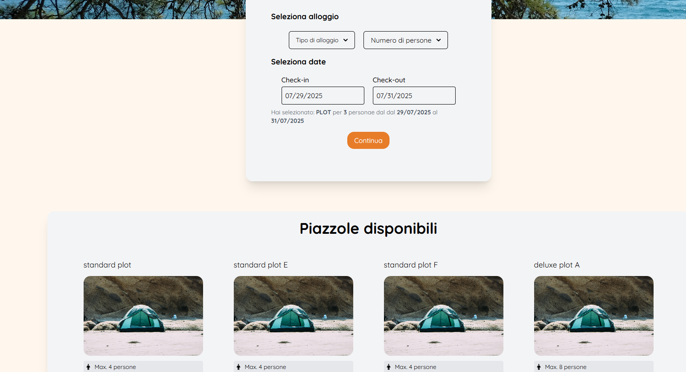

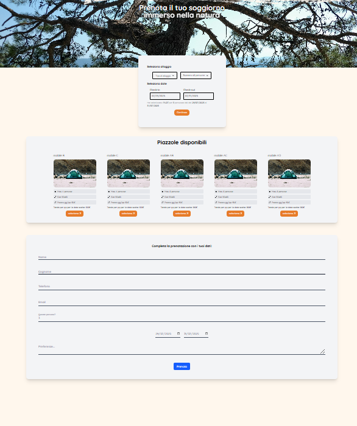


---

## 🛠️ Tecnologie Utilizzate

- **Front-End:** HTML, CSS, TypeScript, React  
- **Back-End:** Java, PostgreSQL  
- **Testing/API:** Postman

---

## 📁 Note Finali

Questo progetto è stato sviluppato come sintesi delle competenze acquisite nel corso di diversi mesi di studio e pratica. Rappresenta un'applicazione reale e scalabile, con ampie possibilità di espansione in futuro.


<p align="right">(<a href="#readme-top">back to top</a>)</p>


<!-- GETTING STARTED -->
## Getting Started

Scaricare entrambe le repository, far partire il back-end per poter effettuare le richieste.

### Prerequisiti

Non dimenticarsi di installare tutti i pacchetti del front-end
* npm
  ```sh
  npm install
  ```

### Installation

Per il back-end è necessario avere un file 'application.properties' nella cartella 'resources' con questa struttura qua:


```sh
spring.application.name=camping-elicriso-progetto-finale-back-end
spring.config.import=file:env.properties

spring.datasource.url=jdbc:postgresql://localhost:5432/camping-elicriso-db
spring.datasource.username=postgres
spring.datasource.password=${postgresql.password}
spring.datasource.driver-class-name=org.postgresql.Driver
spring.jpa.show-sql=true
spring.jpa.hibernate.ddl-auto=update

cloudinary.cloud_name=${cloud_name}
cloudinary.api_key=${api_key}
cloudinary.api_secret=${api_secret}

gmail.mail.transport.protocol=smtp
gmail.mail.smtp.auth=true
gmail.mail.smtp.starttls.enable=true
gmail.mail.debug=true
gmail.mail.from=${gmail.from}
gmail.mail.from.password=${gmail.password}
gmail.smtp.ssl.enable=true
gmail.smtp.host=smtp.gmail.com
gmail.smtp.port=587

#jwt durata token in millisecondi. un giorno
jwt.duration=86400000
#almeno 32 caratteri
#firma
jwt.secret=azchefyhijulmkopqrsiuvxyzahcqefx
```

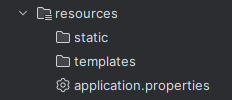

Inoltre è necessario un file 'env.properties' nella cartella principale, con questa struttura (inserire i pro):

```sh
postgresql.password=

#cloudinary
cloud_name=
api_key=
api_secret=
gmail.password=
gmail.from=
```

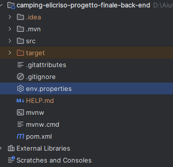


⚠️ **Passi per la creazione dell'admin:**
- Rotta su Postman per la creazione di un utente: http://localhost:8080/auth/register
- Body: 
```sh
{
    "name": "string",
    "surname": "string",
    "email": "string", //necessario @
    "username": "string",
    "password": "string"
}
```
- Cambiare il tipo di utente da STAFF a ADMIN su pdAdmin 4

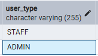


<p align="right">(<a href="#readme-top">back to top</a>)</p>


<!-- USAGE EXAMPLES -->
## Usage

Tutto il sito è accessibile senza bisogno di login, eccetto la parte back office, raggiungibile cliccando la voce 'Admin' nella navbar:
 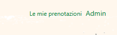

- e in seguito al login:

 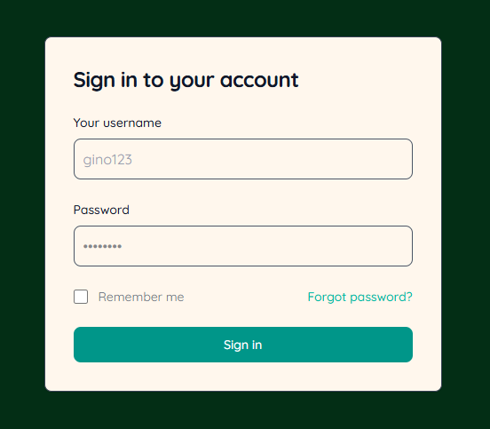

- tramite Backoffice:
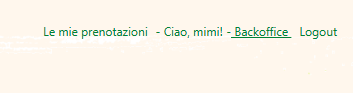

## Previews
 In caso ci fossero problemi nel creare un admin ecco una piccola preview del Backoffice:

- Le pagine del backoffice sono tre: **Prenotazioni - Clienti -Ristorante** è possibile visualizzare tutte le prenotazioni/clienti, cercare per numero/nome, ordinare per nome, stato, data di creazione e data del check-in
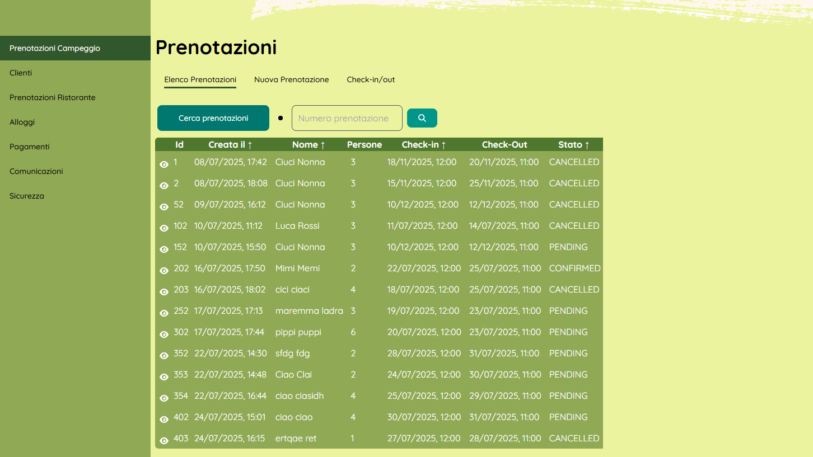
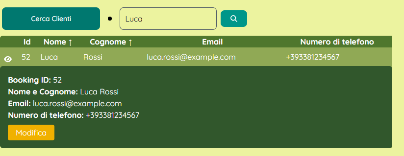

- è possibile modificare lo stato della prenotazione, aggiornare la prenotazione e i clienti
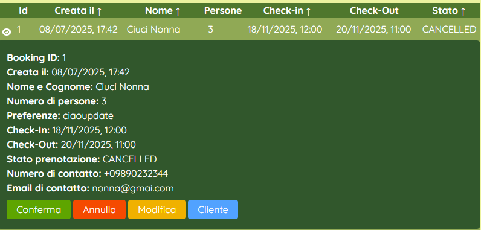
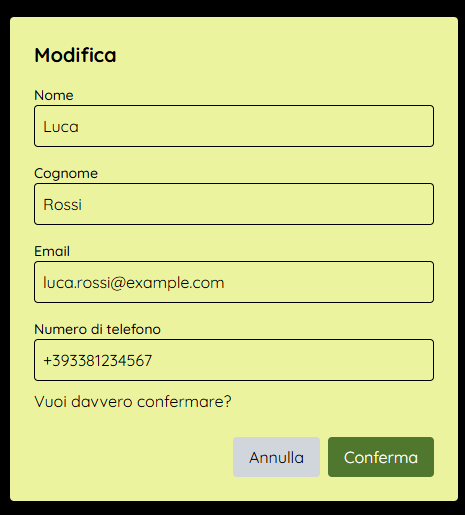


<p align="right">(<a href="#readme-top">back to top</a>)</p>


<!-- ROADMAP -->
## Roadmap

- [ ] Deploy on Vercell
- [ ] Add Payment Page
- [ ] Add Dark mode
- [ ] Add Surroundings Page
- [ ] Expand Info Page
- [ ] Multi-language Support
    - [ ] English
    - [ ] Spanish

<p align="right">(<a href="#readme-top">back to top</a>)</p>


<!-- CONTACT -->
## Contatti

Vincenza Fumarulo - [LinkedIn](https://www.linkedin.com/in/vincenza-fumarulo-486a235a/) - vinni2690@hotmail.com - [LinkGitHubedIn](https://github.com/moonril/)

**Progect Link:**
- Frontend: [https://github.com/Moonril/camping-elicriso-front-end](https://github.com/Moonril/camping-elicriso-front-end)
- Backend: [https://github.com/Moonril/camping-elicriso-progetto-finale-back-end](https://github.com/Moonril/camping-elicriso-progetto-finale-back-end)

<p align="right">(<a href="#readme-top">back to top</a>)</p>


<!-- ACKNOWLEDGMENTS -->
## Acknowledgments

* [Img Pexels](https://www.pexels.com/)
* [GitHub Pages](https://pages.github.com)
* [Font Awesome](https://fontawesome.com)
* [React Icons](https://react-icons.github.io/react-icons/search)

<p align="right">(<a href="#readme-top">back to top</a>)</p>


<!-- MARKDOWN LINKS & IMAGES -->
<!-- https://www.markdownguide.org/basic-syntax/#reference-style-links -->
[contributors-shield]: https://img.shields.io/github/contributors/othneildrew/Best-README-Template.svg?style=for-the-badge
[contributors-url]: https://github.com/othneildrew/Best-README-Template/graphs/contributors
[forks-shield]: https://img.shields.io/github/forks/othneildrew/Best-README-Template.svg?style=for-the-badge
[forks-url]: https://github.com/othneildrew/Best-README-Template/network/members
[stars-shield]: https://img.shields.io/github/stars/othneildrew/Best-README-Template.svg?style=for-the-badge
[stars-url]: https://github.com/othneildrew/Best-README-Template/stargazers
[issues-shield]: https://img.shields.io/github/issues/othneildrew/Best-README-Template.svg?style=for-the-badge
[issues-url]: https://github.com/othneildrew/Best-README-Template/issues
[license-shield]: https://img.shields.io/github/license/othneildrew/Best-README-Template.svg?style=for-the-badge
[license-url]: https://github.com/othneildrew/Best-README-Template/blob/master/LICENSE.txt
[linkedin-shield]: https://img.shields.io/badge/-LinkedIn-black.svg?style=for-the-badge&logo=linkedin&colorB=555
[linkedin-url]: https://linkedin.com/in/othneildrew
[product-screenshot]: images/screenshot.png
[Next.js]: https://img.shields.io/badge/next.js-000000?style=for-the-badge&logo=nextdotjs&logoColor=white
[Next-url]: https://nextjs.org/
[React.js]: https://img.shields.io/badge/React-20232A?style=for-the-badge&logo=react&logoColor=61DAFB
[React-url]: https://reactjs.org/
[Vue.js]: https://img.shields.io/badge/Vue.js-35495E?style=for-the-badge&logo=vuedotjs&logoColor=4FC08D
[Vue-url]: https://vuejs.org/
[Angular.io]: https://img.shields.io/badge/Angular-DD0031?style=for-the-badge&logo=angular&logoColor=white
[Angular-url]: https://angular.io/
[Svelte.dev]: https://img.shields.io/badge/Svelte-4A4A55?style=for-the-badge&logo=svelte&logoColor=FF3E00
[Svelte-url]: https://svelte.dev/
[Laravel.com]: https://img.shields.io/badge/Laravel-FF2D20?style=for-the-badge&logo=laravel&logoColor=white
[Laravel-url]: https://laravel.com
[Bootstrap.com]: https://img.shields.io/badge/Bootstrap-563D7C?style=for-the-badge&logo=bootstrap&logoColor=white
[Bootstrap-url]: https://getbootstrap.com
[JQuery.com]: https://img.shields.io/badge/jQuery-0769AD?style=for-the-badge&logo=jquery&logoColor=white
[JQuery-url]: https://jquery.com 
